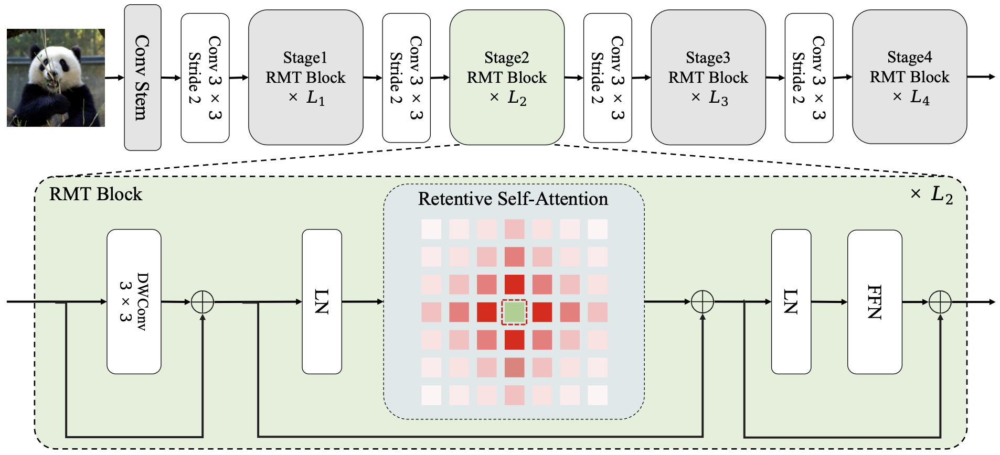

# (CVPR2024)RMT: Retentive Networks Meet Vision Transformers
Congratulations! Our work is accepted by CVPR2024

[Arxiv](https://arxiv.org/abs/2309.11523)

## Abstract

Vision Transformer (ViT) has gained increasing attention in the computer vision community in recent years. However, the core component of ViT, Self-Attention, lacks explicit spatial priors and bears a quadratic computational complexity, thereby constraining the applicability of ViT. To alleviate these issues, we draw inspiration from the recent Retentive Network (RetNet) in the field of NLP, and propose RMT, a strong vision backbone with explicit spatial prior for general purposes. Specifically, we extend the RetNet's temporal decay mechanism to the spatial domain, and propose a spatial decay matrix based on the Manhattan distance to introduce the explicit spatial prior to Self-Attention. Additionally, an attention decomposition form that adeptly adapts to explicit spatial prior is proposed, aiming to reduce the computational burden of modeling global information without disrupting the spatial decay matrix. Based on the spatial decay matrix and the attention decomposition form, we can flexibly integrate explicit spatial prior into the vision backbone with linear complexity. Extensive experiments demonstrate that RMT exhibits exceptional performance across various vision tasks. Specifically, without extra training data, RMT achieves **84.8%** and **86.1%** top-1 acc on ImageNet-1k with **27M/4.5GFLOPs** and **96M/18.2GFLOPs**. For downstream tasks, RMT achieves **54.5** box AP and **47.2** mask AP on the COCO detection task, and **52.8** mIoU on the ADE20K semantic segmentation task.

### Results

|Model|Params|FLOPs|Acc|log|
|:---:|:---:|:---:|:---:|:---:|
|RMT-T|14M|2.5G|82.4%|[RMT-T](RMT_log/rmt_t.txt)|
|RMT-S|27M|4.5G|84.1%|[RMT-S](RMT_log/rmt_s.txt)|
|RMT-S*|27M|4.5G|84.8%|[RMT-S*](RMT_log/rmt_s_label.txt)|
|RMT-B|54M|9.7G|85.0%|[RMT-B](RMT_log/rmt_m.txt)|
|RMT-B*|55M|9.7G|85.6%|[RMT-B*](RMT_log/rmt_m_label.txt)|
|RMT-L|95M|18.2G|85.5%|[RMT-L](RMT_log/rmt_l.txt)|
|RMT-L*|96M|18.2G|86.1%|[RMT-L*](RMT_log/rmt_l_label.txt)|


## Citation

If you use RMT in your research, please consider the following BibTeX entry and giving us a star:
```BibTeX
@inproceedings{fan2023rmt,
  title={RMT: Retentive Networks Meet Vision Transformers},
  author={Qihang Fan and Huaibo Huang and Mingrui Chen and Hongmin Liu and Ran He},
  booktitle={CVPR},
  year={2024}
}
```
