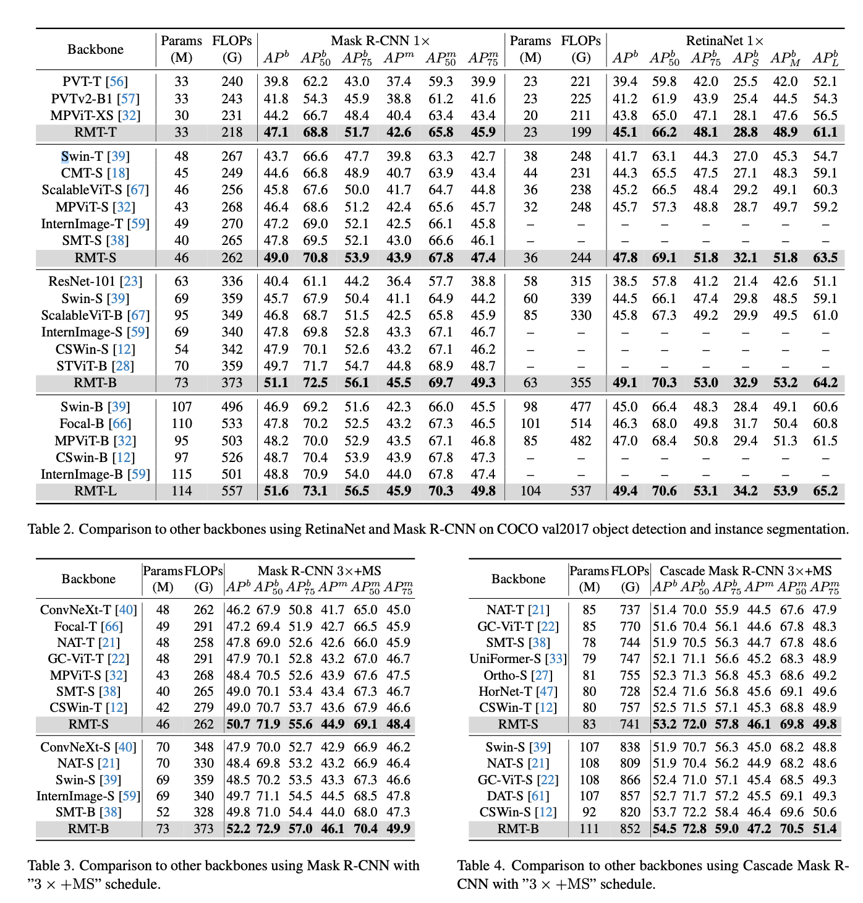

## Usage

1. Install [mmdetection](https://github.com/open-mmlab/mmdetection/blob/master/docs/get_started.md)

2. Download COCO 2017 from the [official website](https://cocodataset.org/#download) and prepare the dataset. The directory structure should look like

   ```
   coco
   ├── annotations
   ├── train2017
   └── val2017
   ```
3. bash install.sh

## ckpt
[RMT_det](https://pan.baidu.com/s/1qWiHjEy_9w29d1lNLVOSnQ?pwd=k22z)

## Training

```bash
cd detection
python setup.py install
bash tools/dist_train.sh  <CONFIG_FILE> <GPU_NUM> --cfg-options model.pretrained=<PRETRAIN_MODEL> [model.backbone.use_checkpoint=True] [other optional arguments] 
```


## Benchmark

To get the FLOPs, run

```bash
python tools/get_flops.py <CONFIG_FILE>
```

## Results


