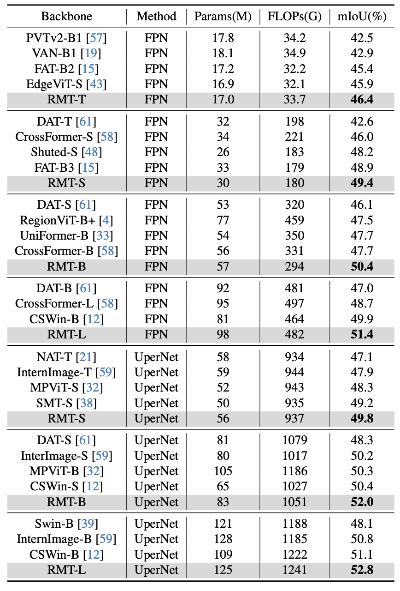

## Installation

1. Install [mmsegmentation](https://github.com/open-mmlab/mmsegmentation).

2. Download ADE20K dataset from the [official website](https://groups.csail.mit.edu/vision/datasets/ADE20K/). The directory structure should look like

   ```
   ade
   └── ADEChallengeData2016
       ├── annotations
       │   ├── training
       │   └── validation
       └── images
           ├── training
           └── validation
   ```


## Training

To train a model, run:

```bash
cd segmentation
bash train_fpn_t_1x.sh
```


## Benchmark

To get the FLOPs, run

```bash
python tools/get_flops.py configs/.../....py
```


## Results


